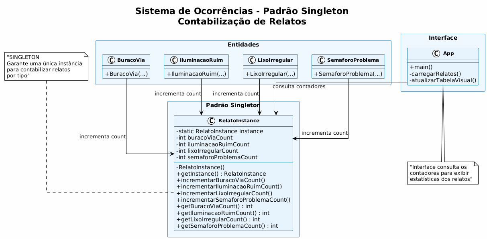
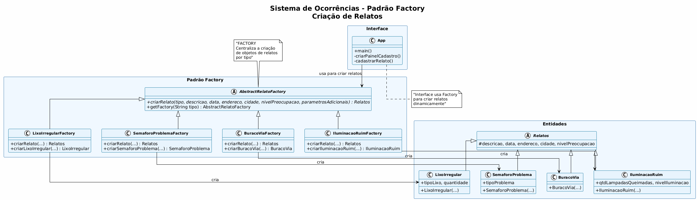
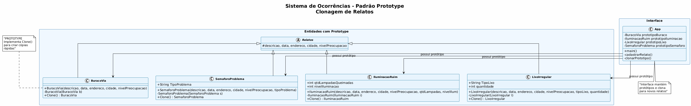
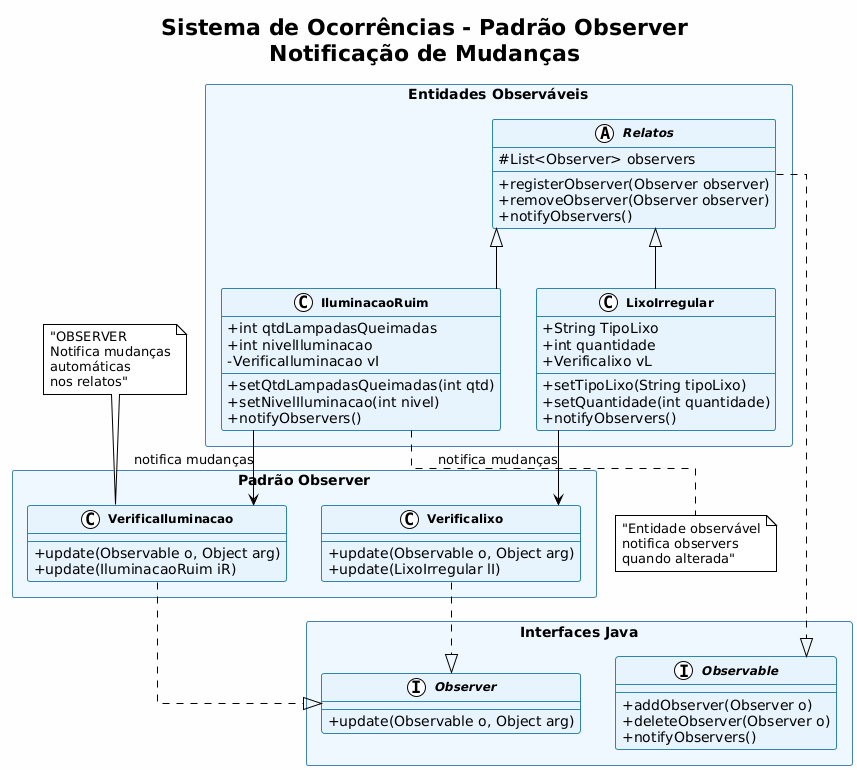

# Sistema de Ocorrências - Smart City

## 📋 Descrição

O **Sistema de Ocorrências - Smart City** é uma aplicação Java desenvolvida para gerenciar relatos de problemas de infraestrutura urbana. O sistema permite aos cidadãos cadastrar e acompanhar ocorrências relacionadas a buracos nas vias, problemas de iluminação, lixo irregular e semáforos com defeito, contribuindo para a construção de cidades mais inteligentes e sustentáveis.

## 🎯 Objetivos

- Facilitar o cadastro de relatos de problemas de infraestrutura urbana
- Fornecer uma interface gráfica intuitiva para cidadãos e gestores
- Implementar padrões de projeto para demonstrar boas práticas de desenvolvimento
- Contribuir para a melhoria da qualidade de vida urbana através da tecnologia

## 🏗️ Arquitetura do Sistema

### Padrões de Projeto Implementados

O projeto demonstra a implementação de **4 padrões de projeto fundamentais**:

#### 1. **Singleton**
- **Classe:** `RelatoInstance`
- **Propósito:** Garantir uma única instância para contabilizar relatos por tipo
- **Localização:** `src/model/designPatterns/RelatoInstance.java`
- **Funcionalidade:** Mantém contadores centralizados para cada tipo de relato

#### 2. **Factory (Abstract Factory)**
- **Classes:** `AbstractRelatoFactory`, `Fabrica`, e fábricas específicas
- **Propósito:** Centralizar a criação de objetos de relatos
- **Localização:** `src/model/fabrica/`
- **Funcionalidade:** Permite criar relatos de forma padronizada e extensível

#### 3. **Prototype**
- **Implementação:** Método `Clone()` em todas as entidades
- **Propósito:** Criar cópias de objetos existentes para novos relatos
- **Localização:** Todas as classes de entidade em `src/model/entities/`
- **Funcionalidade:** Facilita a criação de novos relatos baseados em protótipos

#### 4. **Observer**
- **Classes:** `VerificaIluminacao`, `Verificalixo`, `VerificaBuraco`, `VerificaSemaforo`
- **Propósito:** Notificar mudanças automáticas nos relatos
- **Localização:** `src/model/behavior/`
- **Funcionalidade:** Monitora automaticamente mudanças nos relatos e dispara alertas

### Estrutura de Diretórios

```
SistemaDeOcorrencias/
├── src/
│   ├── App/
│   │   └── App.java
│   ├── model/
│   │   ├── behavior/
│   │   │   ├── VerificaIluminacao.java
│   │   │   ├── Verificalixo.java
│   │   │   ├── VerificaBuraco.java
│   │   │   └── VerificaSemaforo.java
│   │   ├── designPatterns/
│   │   │   └── RelatoInstance.java
│   │   ├── entities/
│   │   │   ├── BuracoVia.java
│   │   │   ├── IluminacaoRuim.java
│   │   │   ├── LixoIrregular.java
│   │   │   ├── Relatos.java
│   │   │   └── SemaforoProblema.java
│   │   ├── fabrica/
│   │   │   ├── AbstractRelatoFactory.java
│   │   │   ├── Fabrica.java
│   │   │   └── factories/
│   │   │       ├── BuracoViaFactory.java
│   │   │       ├── IluminacaoRuimFactory.java
│   │   │       ├── LixoIrregularFactory.java
│   │   │       └── SemaforoProblemaFactory.java
│   │   └── util/
│   │       ├── exception/
│   │       │   └── ExcecoesPersonalizadas.java
│   │       └── persistencia/
│   │           └── GerenciadorArquivos.java
│   └── view/
│       └── InterfaceGrafica.java
├── uml/
│   ├── Singleton.png
│   ├── Factory.png
│   ├── Prototype.png
│   └── Observer.png
├── bin/
└── README.md
```

## 🔧 Funcionalidades

### Cadastro de Relatos
- **Buraco na Via:** Relatos de buracos e irregularidades no asfalto
- **Iluminação Ruim:** Problemas com lâmpadas queimadas e baixa iluminação
- **Lixo Irregular:** Acúmulo de lixo em locais inadequados
- **Semáforo com Problema:** Defeitos em semáforos e sinalização

### Interface Gráfica
- Interface Swing moderna e intuitiva
- Formulários específicos para cada tipo de relato
- Tabela organizada para visualização dos relatos
- Contadores em tempo real por tipo de ocorrência

### Persistência de Dados
- Salvamento automático em arquivo CSV
- Carregamento de dados ao iniciar o sistema
- Contadores persistentes entre sessões

### Sistema de Observadores
- **Monitoramento Automático:** Cada tipo de relato possui seu próprio observer
- **Alertas Inteligentes:** Detecta problemas automaticamente
- **Notificações em Tempo Real:** Console mostra alertas quando problemas são detectados

## 🎮 Como Executar

### Pré-requisitos
- Java JDK 11 ou superior
- IDE Java (Eclipse, IntelliJ IDEA, VS Code, etc.)

### Execução
1. Clone ou baixe o projeto
2. Abra o projeto na sua IDE
3. Execute a classe `App.java` localizada em `src/App/App.java`
4. A interface gráfica será aberta automaticamente

### Uso do Sistema
1. **Cadastrar Relato:** Preencha os campos e clique em "Cadastrar"
2. **Visualizar Relatos:** Use a aba "Listagem" para ver todos os relatos
3. **Contadores:** Clique em "Contagem de Relatos" para ver estatísticas
4. **Observadores:** Monitore o console para ver alertas automáticos

## 📊 Diagramas UML

### Padrão Singleton

- **Classe:** `RelatoInstance`
- **Funcionalidade:** Garante uma única instância para contabilizar relatos
- **Uso:** Contadores centralizados para cada tipo de ocorrência

### Padrão Factory

- **Classes:** `AbstractRelatoFactory` e fábricas específicas
- **Funcionalidade:** Centraliza a criação de objetos de relatos
- **Uso:** Criação padronizada de diferentes tipos de relatos

### Padrão Prototype

- **Implementação:** Método `Clone()` em todas as entidades
- **Funcionalidade:** Cria cópias de objetos existentes
- **Uso:** Facilita a criação de novos relatos baseados em protótipos

### Padrão Observer

- **Classes:** `VerificaIluminacao`, `Verificalixo`, `VerificaBuraco`, `VerificaSemaforo`
- **Funcionalidade:** Monitora mudanças automáticas nos relatos
- **Uso:** Dispara alertas quando problemas são detectados

## 🧪 Testes dos Observers

### VerificaIluminacao
- **Trigger:** Quantidade de lâmpadas queimadas ≥ 5 ou nível de iluminação ≤ 5
- **Alerta:** "ALERTA: Muitas lâmpadas queimadas" ou "ALERTA: Baixa iluminação"

### Verificalixo
- **Trigger:** Quantidade de lixo ≥ 3
- **Alerta:** "ALERTA: Lixo excessivo detectado"

### VerificaBuraco
- **Trigger:** Nível de preocupação ≥ 8
- **Alerta:** "ALERTA: Buraco com alto nível de preocupação"

### VerificaSemaforo
- **Trigger:** Nível de preocupação ≥ 7 ou tipo contém "pane"/"quebrado"
- **Alerta:** "ALERTA: Semáforo com alto nível de preocupação" ou "ALERTA: Semáforo com problema crítico"

## 🛠️ Tecnologias Utilizadas

- **Linguagem:** Java 11
- **Interface:** Java Swing
- **Padrões de Projeto:** Singleton, Factory, Prototype, Observer
- **Persistência:** Arquivo CSV
- **IDE:** Compatível com qualquer IDE Java

## 📈 Funcionalidades Avançadas

### Sistema de Observadores Inteligente
- **Monitoramento Automático:** Cada tipo de relato possui seu próprio observer
- **Detecção de Problemas:** Analisa dados automaticamente
- **Alertas Contextuais:** Mensagens específicas para cada tipo de problema
- **Tempo Real:** Notificações imediatas quando problemas são detectados

### Interface Responsiva
- **Formulários Dinâmicos:** Campos específicos para cada tipo de relato
- **Validação em Tempo Real:** Verifica dados antes de salvar
- **Tabela Organizada:** Visualização clara de todos os relatos
- **Contadores Atualizados:** Estatísticas em tempo real

### Persistência Robusta
- **Salvamento Automático:** Dados preservados entre sessões
- **Carregamento Inteligente:** Restaura estado anterior automaticamente
- **Contadores Persistentes:** Mantém estatísticas corretas
- **Tratamento de Erros:** Sistema robusto contra falhas

## 🎓 Aplicação Acadêmica

Este projeto demonstra a implementação prática de **4 padrões de projeto fundamentais**:

1. **Singleton:** Controle centralizado de contadores
2. **Factory:** Criação padronizada de objetos
3. **Prototype:** Clonagem eficiente de objetos
4. **Observer:** Monitoramento automático de mudanças

### Benefícios Demonstrados
- **Código Organizado:** Separação clara de responsabilidades
- **Manutenibilidade:** Fácil adição de novos tipos de relato
- **Escalabilidade:** Sistema preparado para crescimento
- **Reutilização:** Componentes modulares e reutilizáveis

## 👥 Equipe

- **Desenvolvimento:** Carlos Gabriel Garcia Campos Braga, Leonardo Amichi, João Frederico
- **Disciplina:** Programação Orientada a Objetos
- **Instituição:** UFG

---

**Sistema de Ocorrências - Smart City**  
*Contribuindo para cidades mais inteligentes e sustentáveis* 🏙️✨
